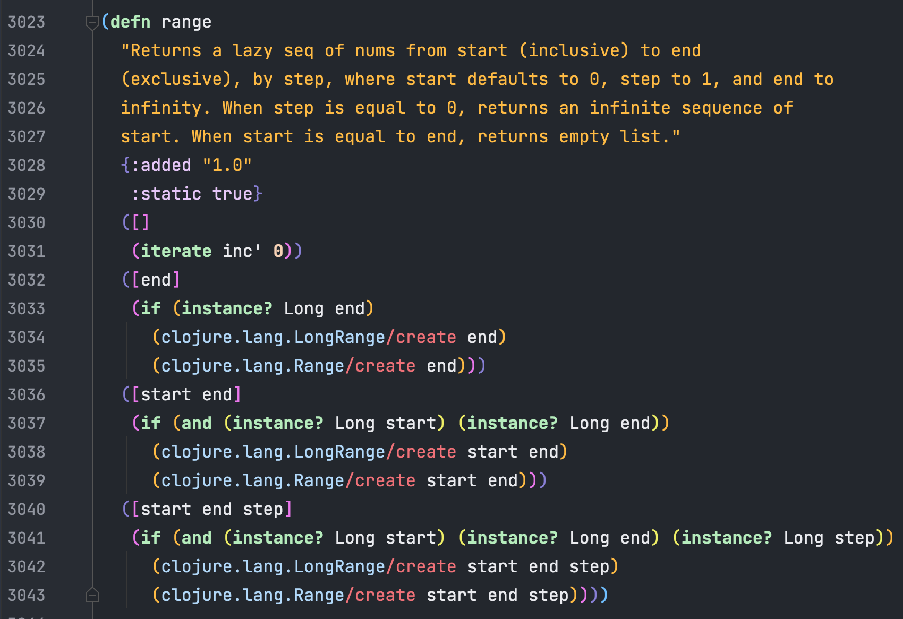

# Borealis

A [Cursive Clojure](https://cursiveclojure.com) theme with pastel colours and a dark background (which also supports rainbow brackets):

## Install
1. Download `Borealis.icls` from this repository
2. Import the settings into IntelliJ IDEA:
  - 'Preferences -> Color Scheme -> Import Scheme -> Intellij IDEA color scheme (.icls) or settings (.jar)'
  - Choose the `Borealis.icls` file
  - Click the "Open" button
3. (Optional) Enable rainbow parentheses:
  - 'Preferences -> Languages & Frameworks -> Clojure -> Rainbow parentheses'

## Revert
1. Choose another scheme from the 'Preferences -> Editor -> Colors & Fonts -> Scheme' combo-box

## Uninstall
1. Click the "Delete" button next to the 'Preferences -> Editor -> Colors & Fonts -> Scheme' combo-box, with "Borealis" selected
